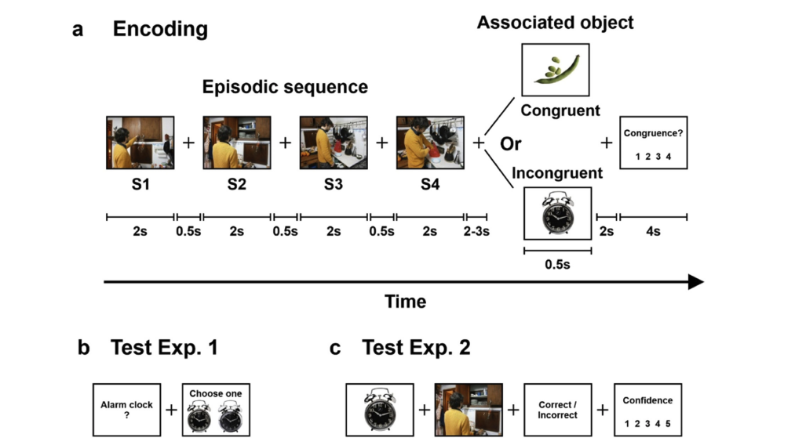

# Contextual incongruency triggers memory reinstatement and the disruption of neural stability
Code of the paper Contextual incongruency triggers memory reinstatement and the disruption of neural stability (2023, Xiongbo Wu)

## Abstract

Schemas, or internal representation models of the environment, are thought to be central in organising our everyday life behaviour by giving stability and predictiveness to the structure of the world. However, when an element from an unfolding event mismatches the schema-derived expectations, the coherent narrative is interrupted and an update to the current event model representation is required. Here, we asked whether the perceived incongruence of an item from an unfolding event and its impact on memory relied on the disruption of neural stability patterns preceded by the neural reactivation of the memory representations of the just-encoded event. Our study includes data from two different experiments whereby human participants (N = 33, 26 females and N = 18, 16 females, respectively) encoded images of objects preceded by trial-unique sequences of events depicting daily routine. We found that neural stability patterns gradually increased throughout the ongoing exposure to a schema-consistent episode, which was corroborated by the re-analysis of data from two other experiments, and that the brain stability pattern was interrupted when the encoding of an object of the event was incongruent with the ongoing schema. We found that the decrease in neural stability for low-congruence items was seen at ∼1000 ms from object encoding onset and that it was preceded by an enhanced N400 ERP and an increased degree of neural reactivation of the just-encoded episode. Current results offer new insights into the neural mechanisms and their temporal orchestration that are engaged during online encoding of schema-consistent episodic narratives and the detection of incongruencies.

## Experiments



Encoding and recognition memory task design for Experiments 1 and 2.

- (a) During the encoding phase for all experiments, participants encoded episodic sequences composed of 4 photographs depicting a routine domestic episode. These were followed by highly congruent or low congruent/incongruent object pictures.
Participants indicated the degree of congruence between the episode and the object.

- (b) In Experiment 1, memory of object pictures was tested by the object word
label followed by a true and a lure item of the same object. Participants had to indicate the correct picture presented during the encoding phase.

- (c) In Experiment 2, each object picture presented during the encoding phase was displayed together with one image from an episodic sequence. Participants were required to indicate
whether the object and episodic image picture corresponded with the episodic + object picture presented in the same trial during the encoding phase.

## Structure 

- `/scripts`. Contains MATLAB scripts designed to generate figures illustrating the study's findings. Each script corresponds to a figure in the paper.

  - `Figure2.m`: Generates the visual representation of neural stability patterns during schema-consistent episodes.
  - `Figure3_ab.m`: Illustrates ERP effects and neural reactivation related to schema-consistent encoding.
  - `Figure3_cd.m`: Further analysis of ERP effects with additional conditions or variables.
  - `Figure4_bc.m`: Focuses on detailed neural pattern changes during the encoding of incongruent objects.
  - `Figure4_de.m`: Extended analysis of neural disruptions during incongruent object encoding.
  - `Figure5.m`: Compiles comprehensive insights into neural stability and reactivation dynamics.
  - `Figure6_ab.m`: Summarizes overall findings and contrasts between different conditions.
  - `Figure6_cd.m`: Provides additional comparative analysis across different experimental setups.

- `/functions`. Contains utility scripts that provide functions used across multiple figure scripts. These might include data preprocessing, analysis routines, and statistical tests.
  
  - `corr_matrix.m`: Computes correlation matrices that are essential for assessing representational similarity across different experimental conditions.
  - `fast_corr.m`: Optimizes the computation of correlations, enhancing the speed of analyses involving large datasets.
  - `plot_areaerrorbar.m`: A utility for plotting data with error bars, typically used for visualizing means and confidence intervals in the figures.
  - `smooth2a.m`: Provides smoothing functions for data, useful in preprocessing steps or in visualizing trends more clearly.

## Data

The datasets for this study are available publicly. Access the data at the Open Science Framework (OSF) repository:

- **OSF Repository Link**: [https://osf.io/jf8nq/](https://osf.io/jf8nq/)

This repository includes all raw and processed data necessary for replicating the analyses and figures in the paper. Please check the OSF project page for details on data usage.

## Citation

```
Wu, X., Packard, P. A., García-Arch, J., Bunzeck, N., & Fuentemilla, L. (2023).
Contextual incongruency triggers memory reinstatement and the disruption of neural stability.
NeuroImage, 273, 120114. doi:10.1016/j.neuroimage.2023.120114
```
